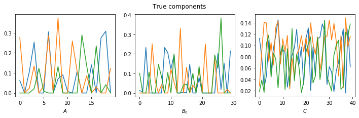
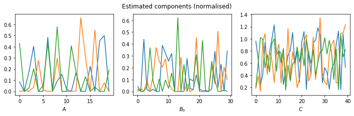

# Block coordinate descent for coupled matrix decomposition

## Simple non-negativity example:
```python
import tenkit
import bcd_tenkit
import numpy as np
import matplotlib.pyplot as plt
```
Create a decomposition for a set of coupled matrices with non-negative factors that follow the PARAFAC2 constraint
```python
I, J, K = 20, 30, 40
rank = 3

A = np.random.standard_normal(size=(I, rank))
A = np.maximum(A, 0)

C = np.random.uniform(size=(K, rank))+ 0.1

blueprint_B = np.random.standard_normal(size=(J, rank))
blueprint_B = np.maximum(blueprint_B, 0)
B = np.empty(shape=(K, J, rank))
for k in range(K):
    B[k] = np.roll(blueprint_B, shift=k, axis=0)

fig, axis = plt.subplots(1,3, figsize=(12,3))
axis[0].plot(A/np.linalg.norm(A))
axis[0].set_xlabel('$A$')
axis[1].plot(B[0]/np.linalg.norm(B[0]))
axis[1].set_xlabel('$B_0$')
axis[2].plot(C/np.linalg.norm(C))
axis[2].set_xlabel('$C$')
fig.suptitle('True components')
plt.show()
```





### Construct a decomposition class

`X` is a tensor with elements given by 

. 
```python
decomposition = tenkit.decomposition.CoupledMatrices(A, B, C)
X = decomposition.construct_tensor()  # Create tensor whose last mode represent matrix number
noisy_X = tenkit.utils.add_noise(X, 0.33)
```

### Create a decomposer to fit a decomposition to the noisy data
```python
decomposer = bcd_tenkit.BCDCoupledMatrixDecomposer(
    rank,
    sub_problems=[
        bcd_tenkit.Mode0ADMM(non_negativity=True),
        bcd_tenkit.DoubleSplittingParafac2ADMM(non_negativity=True),
        bcd_tenkit.Mode2ADMM(non_negativity=True)
    ],
    max_its=1000,
    convergence_tol=1e-8,
    absolute_tol=1e-10,
    print_frequency=100,
)
```

### Fit the decomposion to the data
```python
decomposer.fit(noisy_X)
# Since noisy_X is a 3D numpy array, its matrices is extracted into a list
# like so: matrices = [noisy_X[:, :, k] for k in range(noisy_X.shape[2])]
```

       100: The MSE is 0.310959, f is 4.10324, improvement is 5.81681e-08, coupling_errors: [2.797041014575114e-07, 3.7286601210992627e-05, 1.1582109416421031e-05, 0.0]
       200: The MSE is 0.310959, f is 4.10323, improvement is 4.39264e-09, coupling_errors: [5.990262263456091e-08, 6.885537588476478e-06, 2.6606575848032075e-06, 0.0]
       300: The MSE is 0.310959, f is 4.10323, improvement is 4.85884e-10, coupling_errors: [1.391739533501992e-08, 1.3417764302975869e-06, 6.254408375225476e-07, 0.0]
       400: The MSE is 0.310959, f is 4.10323, improvement is 7.60386e-11, coupling_errors: [3.4006223509147945e-09, 2.7290285517803774e-07, 1.4968182529347784e-07, 0.0]
       500: The MSE is 0.310959, f is 4.10323, improvement is 1.48148e-11, coupling_errors: [8.599414326123561e-10, 5.747019094758922e-08, 3.643730194742261e-08, 0.0]
       600: The MSE is 0.310959, f is 4.10323, improvement is 3.2274e-12, coupling_errors: [2.2269642968672833e-10, 1.2467647259723803e-08, 9.017749253792294e-09, 0.0]
       700: The MSE is 0.310959, f is 4.10323, improvement is 7.45266e-13, coupling_errors: [5.861378751430222e-11, 2.7773053600159416e-09, 2.2668882337945475e-09, 0.0]
       800: The MSE is 0.310959, f is 4.10323, improvement is 1.78145e-13, coupling_errors: [1.5593954942078442e-11, 6.338686358207864e-10, 5.780112817822692e-10, 0.0]
       900: The MSE is 0.310959, f is 4.10323, improvement is 4.39411e-14, coupling_errors: [4.177653827805391e-12, 1.479812357649442e-10, 1.4922954369970718e-10, 0.0]


### Plot the components
```python
estimated_decomposition = decomposer.decomposition
estimated_A = estimated_decomposition.A
estimated_B = estimated_decomposition.B  # A list of factor matrices
estimated_C = estimated_decomposition.C

fig, axis = plt.subplots(1,3, figsize=(12,3))
axis[0].plot(estimated_A/np.linalg.norm(estimated_A, axis=0))
axis[0].set_xlabel('$A$')
axis[1].plot(estimated_B[0]/np.linalg.norm(estimated_B[0], axis=0))
axis[1].set_xlabel('$B_0$')
axis[2].plot(estimated_C/np.linalg.norm(estimated_C[0], axis=0))
axis[2].set_xlabel('$C$')
fig.suptitle('Estimated components (normalised)')
plt.show()
```




